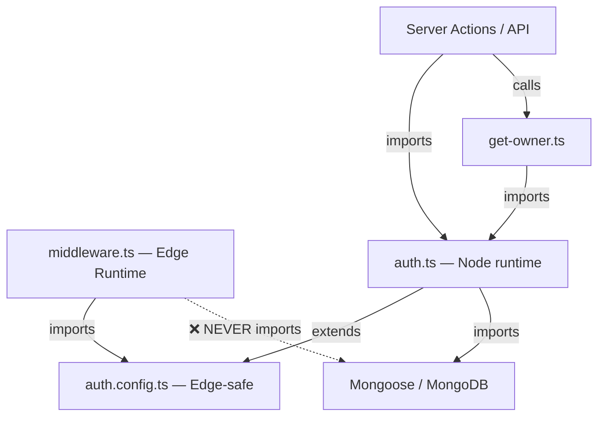
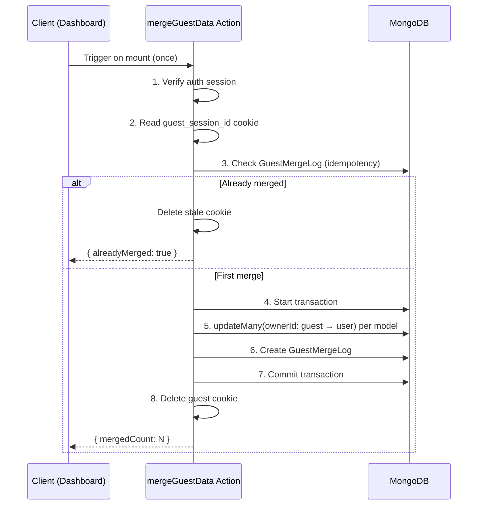

# AI Engineering Context & Strict Architecture Rules

> **SYSTEM INSTRUCTION:** You are a Senior Next.js Architect. When generating code for this project, you MUST adhere to the following invariants.

## 1. Critical Invariants (DO NOT BREAK)

### Identity & Auth
* **Single Source of Truth:** NEVER read cookies directly in components or actions.
* **Required Import:** You MUST use `import { getCurrentOwner } from "@/lib/auth/get-owner"`.
* **Usage Pattern:**
    ```ts
    const { ownerId, type } = await getCurrentOwner(); // type is 'GUEST' | 'USER'
    ```

### Database & Schema
* **Immutability:** All models MUST extend `BaseSchema` (found in `@/models/base`).
* **Owner Field:** `ownerId` is `immutable: true` by default.
* **Mutations:**
    * Standard updates: Use `Model.findOneAndUpdate({ ownerId: ... })`.
    * **Guest Merge:** The ONLY exception to immutability is the `mergeGuestData` action, which uses `updateMany()` to bypass the Mongoose doc-level check.

### Server Actions
* **Wrapper:** All server actions MUST be wrapped in `safeAction` from `@/lib/safe-action`.
* **Validation:** All inputs must be validated via Zod schemas.
* **No "Use Server":** The directive is inside the action file, not the wrapper factory.

### Edge vs. Node Runtime
* **Middleware:** Runs on Edge. **NEVER** import Mongoose models or `auth.ts` here.
* **Auth Config:** Import `auth.config.ts` in middleware/edge contexts.
* **DB Logic:** Keep all Mongoose logic inside Server Actions or `src/lib/db`.

---

## 2. Architecture Reference

### Project Structure
```text
src/
├── app/
│   ├── (protected)/dashboard/
│   │   ├── layout.tsx          ← Client: triggers mergeGuestData on mount
│   │   └── page.tsx            ← Server: shows owner identity
│   ├── actions/
│   │   └── merge-guest-data.ts ← Transactional merge server action
│   ├── auth/
│   │   └── signin/page.tsx     ← GitHub OAuth sign-in
├── lib/
│   ├── auth/
│   │   ├── auth.config.ts      ← Edge-safe (no Mongoose)
│   │   ├── auth.ts             ← Node-only (JWT/session callbacks)
│   │   ├── get-owner.ts        ← getCurrentOwner() — single source of truth
│   └── safe-action.ts          ← Generic action wrapper
├── middleware.ts               ← Auth check + guest_session_id cookie
└── models/
    ├── base.ts                 ← BaseSchema plugin
    ├── guest-merge-log.ts      ← Audit log for merges
    └── note.ts                 ← Example domain model
```

### Runtime Isolation (Edge vs Node)


### Merge Protocol Flow


---

## 3. Key Design Decisions

| Decision | Rationale |
|---|---|
| [getCurrentOwner()](file:///Users/terra/Developer/saas-foundation/src/lib/auth/get-owner.ts#9-41) as single identity resolver | Prevents ad-hoc cookie reads across the codebase |
| `ownerId: immutable: true` + `updateMany()` bypass | Document-level safety with explicit override path for migrations |
| [GuestMergeLog](file:///Users/terra/Developer/saas-foundation/src/models/guest-merge-log.ts#4-11) idempotency check | Graceful recovery if cookie deletion fails post-commit |
| [safe-action.ts](file:///Users/terra/Developer/saas-foundation/src/lib/safe-action.ts) without `"use server"` | Factory functions aren't async — directive belongs on action files |
| Module augmentation targets `@auth/core/jwt` | Auth.js v5 beta re-exports JWT from `@auth/core`, not `next-auth/jwt` |
