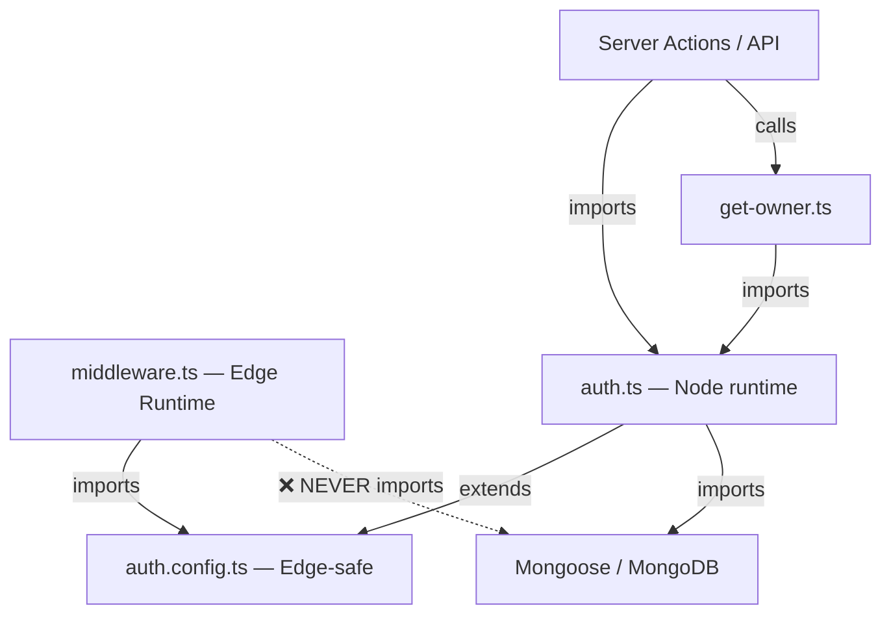
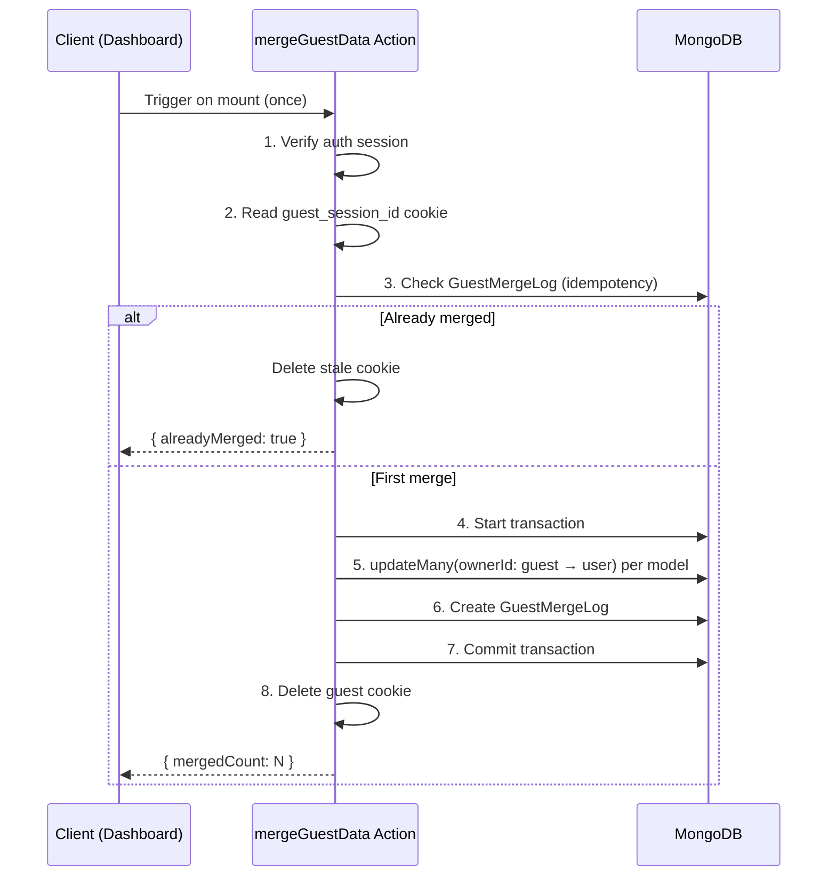

This is a [Next.js](https://nextjs.org) project bootstrapped with [`create-next-app`](https://nextjs.org/docs/app/api-reference/cli/create-next-app).

## Getting Started

First, run the development server:

```bash
npm run dev
# or
yarn dev
# or
pnpm dev
# or
bun dev
```

Open [http://localhost:3000](http://localhost:3000) with your browser to see the result.

You can start editing the page by modifying `app/page.tsx`. The page auto-updates as you edit the file.

This project uses [`next/font`](https://nextjs.org/docs/app/building-your-application/optimizing/fonts) to automatically optimize and load [Geist](https://vercel.com/font), a new font family for Vercel.

## Learn More

To learn more about Next.js, take a look at the following resources:

- [Next.js Documentation](https://nextjs.org/docs) - learn about Next.js features and API.
- [Learn Next.js](https://nextjs.org/learn) - an interactive Next.js tutorial.

You can check out [the Next.js GitHub repository](https://github.com/vercel/next.js) - your feedback and contributions are welcome!

## Deploy on Vercel

The easiest way to deploy your Next.js app is to use the [Vercel Platform](https://vercel.com/new?utm_medium=default-template&filter=next.js&utm_source=create-next-app&utm_campaign=create-next-app-readme) from the creators of Next.js.

Check out our [Next.js deployment documentation](https://nextjs.org/docs/app/building-your-application/deploying) for more details.

# Walkthrough

## Project Structure

```
src/
├── app/
│   ├── (protected)/dashboard/
│   │   ├── layout.tsx          ← Client: triggers mergeGuestData on mount
│   │   └── page.tsx            ← Server: shows owner identity
│   ├── actions/
│   │   ├── __tests__/
│   │   │   └── merge-guest-data.test.ts  ← Integration test pseudo-code
│   │   └── merge-guest-data.ts ← Transactional merge server action
│   ├── api/auth/[...nextauth]/
│   │   └── route.ts            ← Auth.js API handler
│   ├── auth/
│   │   ├── error/page.tsx
│   │   └── signin/page.tsx     ← GitHub OAuth sign-in
│   ├── globals.css
│   ├── layout.tsx              ← Root layout
│   └── page.tsx                ← Landing page
├── lib/
│   ├── auth/
│   │   ├── auth.config.ts      ← Edge-safe (no Mongoose)
│   │   ├── auth.ts             ← Node-only (JWT/session callbacks)
│   │   ├── get-owner.ts        ← getCurrentOwner() — single source of truth
│   │   ├── index.ts
│   │   └── types.ts            ← Module augmentation (role, plan)
│   ├── db/
│   │   └── mongodb.ts          ← Cached Mongoose connection
│   ├── cn.ts                   ← clsx + tailwind-merge
│   ├── env.ts                  ← Zod-validated env vars
│   └── safe-action.ts          ← Generic action wrapper with Zod + error normalization
├── middleware.ts                ← Auth check + guest_session_id cookie
└── models/
    ├── base.ts                 ← BaseSchema plugin (ownerId immutable, isArchived, timestamps)
    ├── guest-merge-log.ts      ← Audit log for merges
    ├── index.ts
    └── note.ts                 ← Example domain model
```

---

## Architecture: Edge vs Node



- **Edge layer**: [middleware.ts](file:///Users/terra/Developer/saas-foundation/src/middleware.ts) + [auth.config.ts](file:///Users/terra/Developer/saas-foundation/src/lib/auth/auth.config.ts) — zero Node dependencies
- **Node layer**: [auth.ts](file:///Users/terra/Developer/saas-foundation/src/lib/auth/auth.ts) + [get-owner.ts](file:///Users/terra/Developer/saas-foundation/src/lib/auth/get-owner.ts) + all models — full DB access

---

## Key Design Decisions

| Decision | Rationale |
|---|---|
| [getCurrentOwner()](file:///Users/terra/Developer/saas-foundation/src/lib/auth/get-owner.ts#9-41) as single identity resolver | Prevents ad-hoc cookie reads across the codebase |
| `ownerId: immutable: true` + `updateMany()` bypass | Document-level safety with explicit override path for migrations |
| [GuestMergeLog](file:///Users/terra/Developer/saas-foundation/src/models/guest-merge-log.ts#4-11) idempotency check | Graceful recovery if cookie deletion fails post-commit |
| [safe-action.ts](file:///Users/terra/Developer/saas-foundation/src/lib/safe-action.ts) without `"use server"` | Factory functions aren't async — directive belongs on action files |
| Module augmentation targets `@auth/core/jwt` | Auth.js v5 beta re-exports JWT from `@auth/core`, not `next-auth/jwt` |

---

## Merge Protocol Flow



---

## Verification Results

| Check | Result |
|---|---|
| `npx tsc --noEmit` | ✅ Pass (0 errors) |
| `npm run build` | ✅ Compiled successfully |
| Static routes | `/ `, `/auth/signin`, `/auth/error`, `/_not-found` |
| Dynamic routes | `/api/auth/[...nextauth]`, `/dashboard` |

---

## Setup Instructions

1. Copy [.env.example](file:///Users/terra/Developer/saas-foundation/.env.example) → `.env.local` and fill in real values
2. Ensure MongoDB is running as a **replica set** (required for transactions)
3. Create a GitHub OAuth app at [github.com/settings/developers](https://github.com/settings/developers)
4. Run `npm run dev`
